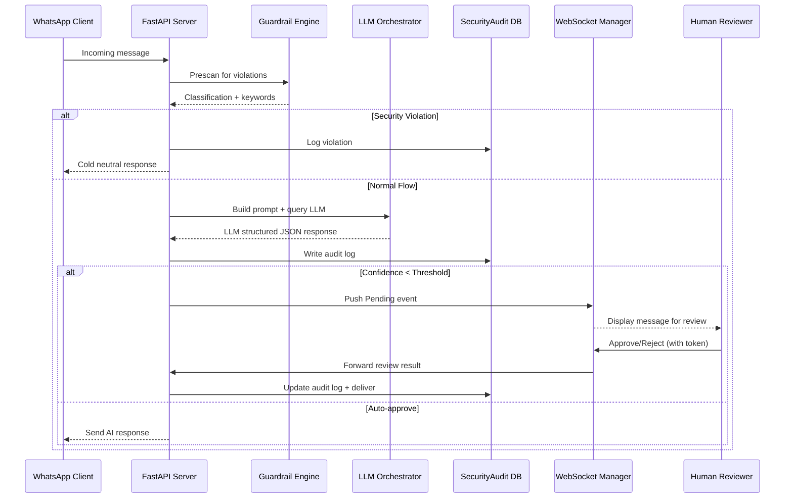

# System Architecture — Enterprise AI CRM: Human-in-the-Loop Orchestrator

This document explains the end-to-end data flow and component interactions within the system.

---

## 🔄 Data Flow Overview

### 1. Message Ingestion
- WhatsApp webhook sends an inbound message to the FastAPI endpoint `/whatsapp/incoming`.
- A lightweight schema validation ensures payload integrity before processing.

### 2. Guardrail Engine — Pre-Scan Phase
- The message is passed into the `GuardrailEngine.prescan()` method.
- The engine performs:
  - Keyword classification for political, legal, medical, or abusive content.
  - Business-boundary detection via configured `forbidden_topics`.
- Returns a tuple: `(classification, triggered_keywords)`.

If the message is a **security violation**, a cold neutral response is immediately generated:
> "No emitimos comentarios sobre temas sociales o políticos."

The event is logged in `SecurityAudit` with `status=Blocked`.

If the message is safe, processing continues.

---

### 3. Intent & Context Compilation
- The AI Orchestrator retrieves the active `AIConfig`:
  - Identity prompt  
  - Tone and language code  
  - Intent mapping rules (JSON)  
  - Knowledge base (active datasets)
- The orchestrator builds a **runtime system prompt** that combines:
  - Operational rules  
  - Business boundaries  
  - Dynamic intent mappings  
  - Tone and language directives

This context is serialized into a structured prompt and sent to the local LLM.

---

### 4. LLM Inference and Response Parsing
- The orchestrator calls the LLM endpoint (`http://localhost:1234/v1/chat/completions`).
- Receives a JSON-formatted structured reply:
```json
{
  "reply": "Gracias por tu interés en nuestros productos.",
  "domain": "Commercial/Logistics",
  "classification": "in_scope",
  "primary_intent": "Consulta de Producto",
  "confidence_self_assessment": 87
}
```

Latency and token usage are recorded.

### 5. Post-Scan and Audit Logging
The output is re-evaluated:
- Classification override (security/out-of-scope).
- Confidence threshold enforcement.

An audit record is created:
`latency_ms`, `tokens_used`, `classification`, `intent`, `confidence`.

Metrics increment:
- `ai_requests_total`
- `security_violations_total` (if applicable)

### 6. Human-in-the-Loop Review Pipeline
If `confidence_self_assessment < review_threshold`:
- The message enters the **Pending Approval Queue**.
- The WebSocket Manager broadcasts the event to all connected reviewers.

**Concurrency behavior:**
- Each message event carries an **idempotency token (UUID)**.
- Review actions (approve, edit, reject) must include this token.
- The backend validates token uniqueness to ensure idempotent commits.
- Backpressure controls prevent broadcast overload via per-client queues.

On approval:
- The reviewed message is delivered to WhatsApp via the outbound channel.
- The `SecurityAudit` record is updated with `status="Approved"`.

### 7. Observability & Metrics Pipeline
Every interaction emits Prometheus-compatible metrics.
Dashboards display:
- Latency histogram
- Security violations per hour
- Auto vs Manual approval ratios
- Confidence distribution curve

Logs are structured (JSON) and include timestamps and reasoning traces.

---

## 🧩 Sequence Diagram


## 🧱 Component Diagram
```mermaid
graph TD
    subgraph "External Interfaces"
        A[WhatsApp Webhook]
        H[HITL Reviewer Dashboard]
    end

    subgraph "Backend (FastAPI)"
        G[Guardrail Engine]
        L[LLM Orchestrator]
        WSM[WebSocket Manager]
        D[(SecurityAudit DB)]
    end

    subgraph "AI Layer"
        LM[Local LLM (LM Studio / OpenAI API)]
    end

    A --> G
    G --> L
    L --> LM
    LM --> L
    L --> D
    L --> WSM
    WSM --> H
    H --> WSM
    WSM --> D
```

## 🧩 Scalability & Reliability Notes
- **Idempotency**: Every API action carries a deterministic UUID; duplicate events ignored server-side.
- **Backpressure**: WebSocket broadcasts maintain per-client bounded queues; slow consumers dropped gracefully.
- **Resilience**: AI inference wrapped with timeouts; latency violations flagged in audit logs.
- **Observability**: Every subsystem emits metrics; integrated Prometheus exporter ensures transparent performance tracking.
- **Extendability**: New LLM backends or guardrail rules can be added without core rewrites.
