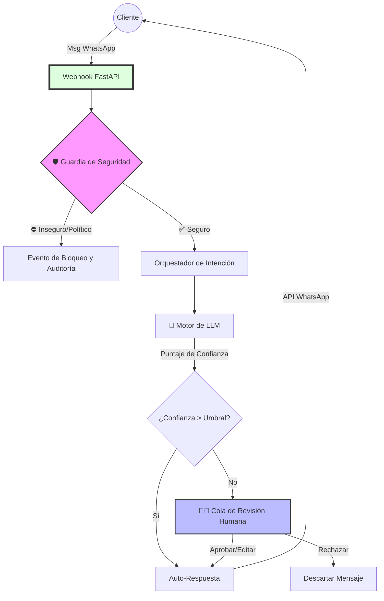

[English](README.md) | [Español](README.es.md)

# CRM de IA para Empresas: Orquestador Human-in-the-Loop

Un sistema de orquestación de IA de grado de producción que integra LLMs locales con WhatsApp para una comunicación con el cliente que cumple con las normas, es observable y está supervisada por humanos.
Este proyecto implementa salvaguardas de seguridad deterministas, mapeo de intención dinámico y un flujo de trabajo de aprobación Human-in-the-Loop (HITL) en tiempo real.

---

## 🧠 Resumen

El Orquestador de CRM de IA para Empresas combina la **automatización de LLM**, la **aplicación de la seguridad** y la **revisión humana** en una única arquitectura impulsada por eventos.
Está diseñado para entornos B2B donde las interacciones con los clientes deben cumplir con estrictas políticas operativas y de contenido.

**Objetivos principales:**
- Mantener el *control total y la auditabilidad* sobre cada salida de la IA.
- Aplicar una **lógica de protección** determinista que distinga las *violaciones de seguridad* de los temas *fuera del alcance comercial*.
- Proporcionar supervisión HITL en tiempo real para las respuestas generadas por la IA pendientes.
- Mostrar datos enriquecidos de observabilidad (latencia, confianza, recuento de violaciones y métricas de tokens).
- **Modelo de configuración híbrido:** Admite valores predeterminados de variables de entorno con anulaciones de base de datos en tiempo de ejecución para una reconfiguración sin tiempo de inactividad.

### ⚡ Flujo del Sistema

---

## 🎨 Branding y Tematización Dinámica

El sistema cuenta con un **Motor de Branding Semántico** que permite una personalización completa de marca blanca sin cambios de código.

- **Variables semánticas:** La interfaz de usuario utiliza tokens abstractos como `--brand-primary`, `--brand-surface` y `--brand-bg` en lugar de colores codificados.
- **Personalización en tiempo de ejecución:** Los administradores pueden configurar el `Color Primario`, el `Radio del Borde` y la `Densidad de la Interfaz` directamente desde el Panel de Administración.
- **Nativo en modo oscuro:** El sistema está construido "Primero en Modo Oscuro" pero admite capacidades completas de tematización.

---

## 🔧 Configuración

La aplicación utiliza un **Modelo de Configuración Híbrido** con el siguiente orden de precedencia:
1. **Anulación de BD** (Prioridad máxima): Configuración guardada a través de la interfaz de administración.
2. **Variable de Entorno**: Valores predeterminados en caso de que no exista una configuración en la base de datos.
3. **Valor predeterminado codificado**: Red de seguridad final.

### Variables de Entorno Clave

| `VITE_API_URL` | Frontend | URL base para la API. **Debe ser accesible por el navegador del cliente.** | `http://127.0.0.1:8000` |
| `OPENAI_API_BASE` | Backend | URL del endpoint de LLM predeterminado. | `http://localhost:1234/v1` |
| `DEFAULT_PRIMARY_COLOR` | Backend | Color de marca primario predeterminado (Hex). | `#2563eb` |
| `ALLOWED_ORIGINS` | Backend | Orígenes permitidos de CORS (separados por comas). | `http://127.0.0.1:5173,http://localhost:5173` |

> **Consejo pro:** Los problemas de conexión a menudo se resuelven usando `127.0.0.1` en lugar de `localhost` para las llamadas API en entornos Windows. El sistema está estandarizado para usar `http://127.0.0.1:8000`.

---

## ⚙️ Arquitectura del Sistema

**Tecnologías de Backend:** FastAPI · SQLAlchemy · WebSockets · API compatible con LM Studio / OpenAI  
**Tecnologías de Frontend:** React · TypeScript · Vite · TailwindCSS v4  
**Subsistemas principales:**
1. **Motor de Protección (Centinela de Seguridad)**  
   - Escanea previamente todos los mensajes entrantes en busca de dominios restringidos (políticos, legales, médicos).  
   - Aplica una clasificación determinista: `security_violation`, `out_of_scope`, `in_scope`.  
   - Proporciona una aplicación de "Cero Eco" y respuestas neutrales frías para el contenido marcado.

2. **Orquestador de Intención**  
   - Construye dinámicamente el contexto de LLM utilizando las `intent_rules` y los `forbidden_topics` configurados en la interfaz de usuario.  
   - Genera avisos de clasificación en tiempo de ejecución para los LLMs.  
   - Admite la configuración de identidad multiinquilino y la personalización de tono e idioma.

3. **Motor de IA**  
   - Dirige las solicitudes de inferencia a un endpoint de LLM local o remoto.  
   - Aplica auditorías posteriores a la inferencia para obtener puntajes de confianza, métricas de latencia y uso de tokens.  
   - Aplica umbrales de auto-respuesta basados en la confianza frente a la revisión manual.

4. **Flujo de Revisión HITL (WebSocket)**  
   - Mantiene una cola en tiempo real para las respuestas de IA pendientes.  
   - Admite acciones de `Aprobar`, `Editar` y `Rechazar`.  
   - Utiliza tokens de eventos idempotentes y una difusión segura ante la contrapresión.

5. **Observabilidad y Auditoría**  
   - Registra cada evento en `SecurityAudit` (clasificación, latencia_ms, tokens_utilizados, palabras clave activadas).  
   - Expone el endpoint `/metrics` para los raspadores de Prometheus.  
   - Proporciona histogramas de latencia y contadores de eventos bloqueados.

---

## 🔁 Modelo de Concurrencia (WebSockets)

El sistema utiliza un modelo de concurrencia basado en eventos y no bloqueante.

**Características principales:**
- Cada operador conectado (revisor de HITL) se suscribe a un canal de WebSocket.  
- Las sugerencias de LLM entrantes se envían como eventos pendientes con claves de idempotencia.  
- Los operadores realizan acciones de `aprobar`, `editar` o `rechazar`; cada acción se confirma en el lado del servidor.  
- Un administrador de difusión seguro para la concurrencia garantiza:
  - **Sin duplicación de mensajes:** mediante tokens de eventos basados en UUID.
  - **Gestión de la contrapresión:** los clientes lentos reciben colas limitadas; los sockets obsoletos se descartan.  
  - **Sincronización optimista de la interfaz de usuario:** el estado del cliente se actualiza antes de la confirmación y luego se reconcilia después del reconocimiento.

---

## 📊 Observabilidad de la IA

El Orquestador de CRM trata la observabilidad como un **subsistema de primera clase**.

**Métricas registradas por interacción:**
| Métrica | Descripción |
|--------|--------------|
| `latency_ms` | Latencia de respuesta de LLM de extremo a extremo |
| `tokens_used` | Total de tokens utilizados en la inferencia |
| `confidence_score` | Confianza de LLM autoevaluada (0–100) |
| `classification` | Límite entre seguridad y negocio |
| `triggered_keywords` | Disparadores de protección coincidentes |
| `audit_status` | Pasado, Bloqueado o Violación de Latencia |

---

## 🐋 Ejecución fácil con Docker

La forma más fácil de ejecutar todo el sistema (incluyendo Redis) es usando Docker Compose.

### Requisitos previos
- [Docker Desktop](https://www.docker.com/products/docker-desktop/) instalado y en funcionamiento.

### 🚀 Iniciando el Proyecto
Ejecute el siguiente comando en el directorio principal:
```bash
docker compose up -d --build
```

### 📂 Accediendo a los Servicios
- **Panel de control (Frontend)**: [http://localhost:5173](http://localhost:5173)
- **Documentación de la API**: [http://localhost:8000/docs](http://localhost:8000/docs)

---

## 🚀 Configuración local manual (Desarrollo)
```bash
cd server
python -m venv venv
source venv/bin/activate
pip install -r requirements.txt
python main.py
```

### Configuración del Frontend
```bash
cd client
npm install
npm run dev
```

### 🧪 Pruebas y Validación
El sistema cuenta con una suite de pruebas integral en múltiples niveles:

1. **Pruebas Unitarias del Backend**: (Pytest) Cubre Auth, Pagos, Agente de IA y CRMs.
   ```bash
   pytest -v
   ```
2. **Scripts de Integración**: Verificación directa de la API para Productos, Clientes y Pedidos.
   ```bash
   python test_products.py && python test_clients.py && python test_orders.py
   ```
3. **Pruebas E2E (Playwright)**: Verificación del flujo completo del navegador (Login -> Dashboard -> Chat).
   ```bash
   cd client && npx playwright test --grep @stable --workers=1
   ```

> [!IMPORTANT]
> **Sembrado de Datos**: Ejecute siempre `python server/seed_config.py` después de reiniciar la base de datos para garantizar que el sistema comience con una configuración operativa válida y datos de muestra.

### 🚀 Integración CI/CD
Flujos de trabajo de GitHub Actions integrados:
- **`ci.yml`**: Pruebas unitarias del backend y verificación de construcción del frontend.
- **`qa.yml`**: Orquestación E2E de stack completo con sembrado automático y verificación de Playwright.

### ⚙️ Configuración y Secretos
Las claves de API y la configuración sensible ahora se gestionan a través de la API de Base de Datos/Administración, no mediante variables de `env`.
- Navegue a `http://localhost:5174/admin` (Frontend) para configurar la lógica.
- Las claves se migran desde `.env` en la primera ejecución a través de `migrate_secrets.py`.
- **Secretos de CI**: Asegúrese de agregar `ENCRYPTION_KEY` a los Secretos de GitHub para compilaciones de CI exitosas.

---

## 🧩 **ARCHITECTURE.md — Flujo de Datos y Diseño del Sistema**
Consulte [ARCHITECTURE.md](./ARCHITECTURE.md) para ver diagramas de secuencia y análisis detallados del flujo de datos.

---

## 🧰 Licencia
Licencia MIT
