[English](README.md) | [Español](README.es.md)

# Enterprise AI CRM: Human-in-the-Loop Orchestrator

A production-grade AI orchestration system integrating Local LLMs with WhatsApp for compliant, observable, and human-supervised customer communication.  
This project implements deterministic safety guardrails, dynamic intent mapping, and a real-time Human-in-the-Loop (HITL) approval workflow.

---

## 🧠 Overview

The Enterprise AI CRM Orchestrator combines **LLM automation**, **safety enforcement**, and **human review** into a single event-driven architecture.  
It is designed for B2B environments where customer interactions must comply with strict operational and content policies.

**Core Objectives:**
- Maintain *full control and auditability* over every AI output.
- Enforce deterministic **Guardrail logic** distinguishing *security violations* from *business out-of-scope* topics.
- Provide real-time HITL oversight for pending AI-generated responses.
- Surface rich observability data (latency, confidence, violation counts, and token metrics).
- **Hybrid Configuration Model:** Supports environment-variable defaults with runtime database overrides for zero-downtime reconfiguration.
### ⚡ System Flow

```mermaid
graph TD
    Client((Client)) -->|WhatsApp Msg| API[FastAPI Webhook]
    API --> Guardrail{🛡️ Security Guardrail}
    
    Guardrail -->|⛔ Unsafe/Political| Block[Block & Audit Event]
    Guardrail -->|✅ Safe| Context[Intent Orchestrator]
    
    Context --> AI[🤖 LLM Engine]
    AI --Confidence Score--> Check{Confidence > Threshold?}
    
    Check -->|Yes| Reply[Auto-Reply]
    Check -->|No| HITL[👨‍💻 Human Review Queue]
    
    HITL -->|Approve/Edit| Reply
    HITL -->|Reject| Drop[Drop Message]
    
    Reply -->|WhatsApp API| Client
    
    style Guardrail fill:#f9f,stroke:#333,stroke-width:2px
    style HITL fill:#bbf,stroke:#333,stroke-width:2px
    style API fill:#dfd,stroke:#333,stroke-width:4px
```

---

## 🎨 Dynamic Branding & Theming

The system features a **Semantic Branding Engine** that allows complete white-labeling without code changes.

- **Semantic Variables:** The UI uses abstract tokens like `--brand-primary`, `--brand-surface`, and `--brand-bg` instead of hardcoded colors.
- **Runtime Customization:** Admins can configure the `Primary Color`, `Border Radius`, and `UI Density` directly from the Admin Panel.
- **Dark Mode Native:** The system is built "Dark Mode First" but supports full theming capabilities.

---

## 🔧 Configuration

The application uses a **Hybrid Configuration Model** with the following precedence order:
1. **DB Override** (Highest Priority): Settings saved via the Admin UI.
2. **Environment Variable**: Fallback defaults if no DB config exists.
3. **Hardcoded Default**: Final safety net.

### Key Environment Variables

| Variable | Scope | Description | Default |
|----------|-------|-------------|---------|
| `VITE_API_URL` | Frontend | Base URL for the API. **Must be accessible by the client browser.** | `http://127.0.0.1:8000` |
| `OPENAI_API_BASE` | Backend | Default LLM endpoint URL. | `http://localhost:1234/v1` |
| `DEFAULT_PRIMARY_COLOR` | Backend | Default primary brand color (Hex). | `#2563eb` |
| `ALLOWED_ORIGINS` | Backend | CORS allowed origins (comma-separated). | `http://127.0.0.1:5173,http://localhost:5173` |

> **Pro Tip:** Connection issues are often resolved by using `127.0.0.1` instead of `localhost` for API calls on Windows environments. The system is standardized to use `http://127.0.0.1:8000`.

---

## ⚙️ System Architecture

**Backend Stack:** FastAPI · SQLAlchemy · WebSockets · LM Studio / OpenAI-compatible API  
**Frontend Stack:** React · TypeScript · Vite · TailwindCSS v4  
**Core Subsystems:**
1. **Guardrail Engine (Security Sentinel)**  
   - Pre-scans all inbound messages for restricted domains (political, legal, medical).  
   - Applies deterministic classification: `security_violation`, `out_of_scope`, `in_scope`.  
   - Provides Zero-Echo enforcement and cold neutral responses for flagged content.

2. **Intent Orchestrator**  
   - Dynamically constructs LLM context using UI-configured `intent_rules` and `forbidden_topics`.  
   - Generates runtime classification prompts for LLMs.  
   - Supports multi-tenant identity configuration and tone/language customization.

3. **AI Engine**  
   - Routes inference requests to a local or remote LLM endpoint.  
   - Applies post-inference auditing for confidence scores, latency metrics, and token usage.  
   - Enforces confidence-based auto-response vs manual-review thresholds.

4. **HITL Review Pipeline (WebSocket)**  
   - Maintains real-time queue for pending AI responses.  
   - Supports `Approve`, `Edit`, and `Reject` actions.  
   - Uses idempotent event tokens and backpressure-safe broadcasting.

5. **Observability & Audit**  
   - Persists every event into `SecurityAudit` (classification, latency_ms, tokens_used, triggered_keywords).  
   - Exposes `/metrics` endpoint for Prometheus scrapers.  
   - Provides latency histograms and blocked-event counters.

---

## 🔁 Concurrency Model (WebSockets)

The system uses a non-blocking, event-driven concurrency model.

**Core characteristics:**
- Each connected operator (HITL reviewer) subscribes to a WebSocket channel.  
- Incoming LLM suggestions are pushed as pending events with idempotency keys.  
- Operators perform `approve`, `edit`, or `reject` actions — each action acknowledged server-side.  
- A concurrency-safe broadcast manager ensures:
  - **No message duplication:** via UUID-based event tokens.
  - **Backpressure management:** slow clients receive bounded queues; stale sockets are dropped.  
  - **Optimistic UI synchronization:** client state updated before confirmation, then reconciled after acknowledgment.

**Flow Summary:**
1. Client submits a WhatsApp message → FastAPI receives event.  
2. Guardrail Engine classifies and pre-screens message.  
3. AI Orchestrator generates contextual system prompt → queries local LLM.  
4. Response logged with latency, confidence, and classification.  
5. If confidence < threshold → queued in HITL for manual approval via WebSocket.  
6. Approved/rejected messages persist audit events and update message state.

---

## 📊 AI Observability

The CRM Orchestrator treats observability as a **first-class subsystem**.

**Logged Metrics per Interaction:**
| Metric | Description |
|--------|--------------|
| `latency_ms` | End-to-end LLM response latency |
| `tokens_used` | Total tokens used in inference |
| `confidence_score` | Self-assessed LLM confidence (0–100) |
| `classification` | Security vs business boundary |
| `triggered_keywords` | Matched guardrail triggers |
| `audit_status` | Passed, Blocked, or Latency_Violation |

**Exported Prometheus Metrics:**
- `ai_requests_total{status}`  
- `security_violations_total{type}`  
- `auto_approved_total`  
- `manual_reviews_total`  
- `average_latency_ms`  
- `confidence_histogram_bucket`  

**Audit Schema (SQLAlchemy):**
```python
class SecurityAudit(Base):
    client_id: str
    input_message: str
    output_message: str
    intent: str
    classification: str
    confidence: int
    latency_ms: int
    tokens_used: int
    status: str
    reasoning: str
    triggered_keywords: str
```

---

## 🐋 Easy Run with Docker

The easiest way to run the entire system (including Redis) is using Docker Compose.

### Prerequisites
- [Docker Desktop](https://www.docker.com/products/docker-desktop/) installed and running.

### 🚀 Starting the Project
Run the following command in the root directory:
```bash
docker compose up -d --build
```

### 📂 Accessing the Services
- **Dashboard (Frontend)**: [http://localhost:5173](http://localhost:5173)
- **API Documentation**: [http://localhost:8000/docs](http://localhost:8000/docs)

### 🛑 Stopping the Project
```bash
docker compose down
```

---

## 🚀 Manual Local Setup (Development)
```bash
cd server
python -m venv venv
source venv/bin/activate
pip install -r requirements.txt
python main.py
```

### Frontend Setup
```bash
cd client
npm install
npm run dev
```

### Local LLM Setup
1. Open LM Studio
2. Load a model (e.g., Mistral-7B or Llama-3)
3. Start local API server on port 1234

### 🧪 Testing and Validation
The system features a comprehensive multi-layer test suite:

1. **Backend Unit Tests**: (Pytest) Covers Auth, Payments, AI Agent, and CRMs.
   ```bash
   pytest -v
   ```
2. **Integration Scripts**: Direct API verification for Products, Clients, and Orders.
   ```bash
   python test_products.py && python test_clients.py && python test_orders.py
   ```
3. **E2E Tests (Playwright)**: Full browser flow verification (Login -> Dashboard -> Chat).
   ```bash
   cd client && npx playwright test --grep @stable --workers=1
   ```

> [!IMPORTANT]
> **Data Seeding**: Always run `python server/seed_config.py` after a database reset to ensure the system starts with a valid operational configuration and sample data.

### 🚀 CI/CD Integration
Integrated GitHub Actions workflows:
- **`ci.yml`**: Backend unit tests and frontend build verification.
- **`qa.yml`**: Full-stack E2E orchestration with automated seeding and Playwright verification.

### ⚙️ Configuration & Secrets
API Keys and sensitive configuration are now managed via the Database/Admin API, not `env` variables.
- navigate to `http://localhost:5174/admin` (Frontend) to configure logic.
- Keys are migrated from `.env` on first run via `migrate_secrets.py`.
- **CI Secrets**: Ensure `ENCRYPTION_KEY` is added to GitHub Secrets for successful CI builds.

---

## 🧩 **ARCHITECTURE.md — Data Flow and System Design**
See [ARCHITECTURE.md](./ARCHITECTURE.md) for sequence diagrams and detailed data flow analysis.

---

## 📈 Engineering Audit & Standards
This repository underwent a full security and architectural audit (v1.3 stabilization).
- **Status:** 🟢 Production Ready
- **Security:** Deterministic Guardrail enforcement (Zero-Echo)
- **Compliance:** Full interaction audit trails and locked configuration snapshots.
- **Next Roadmap:** Focus on Enterprise scaling (PostgreSQL) and WebSocket heartbeats.

---

## 🧰 License
MIT License
